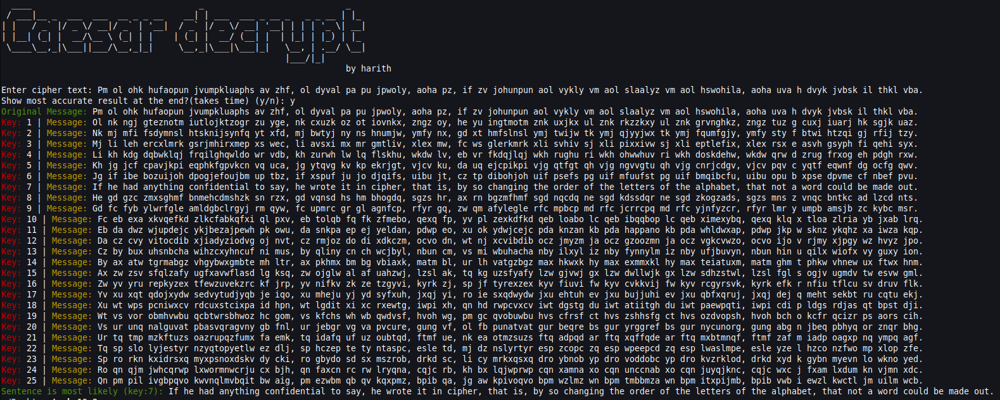

# Caesar Cipher Decryption

This project implements a simple Caesar Cipher decryption tool in C++. The Caesar Cipher is a type of substitution cipher in which each letter in the plaintext is shifted a certain number of places down the alphabet.

## Features

- Decrypts text encrypted with the Caesar Cipher.
- Outputs all possible combinations with all 25 keys.
- Gives most likely accurate answer with key.

## Usage

1. **Clone the repository**:
    ```sh
    git clone <repository-url>
    cd caesar-decrypt
    ```

2. **Build the project**:
    ```sh
    g++ main.cpp Decrypt.cpp -o caesar-decrypt
    ```

3. **Run the executable**:
    ```sh
    ./caesar-decrypt
    ```

4. **Follow the on-screen instructions** to input the encrypted text and get the decrypted output.

## File Structure

- `main.cpp`: Contains the main function and handles user input/output.
- `Decrypt.h`: Header file declaring the `Decrypt` class.
- `words.h`: Contains a C-style array representing the contents of the words.txt file. (for the accurate answer function)
- `Decrypt.cpp`: Implementation of the `Decrypt` class.

## Example

